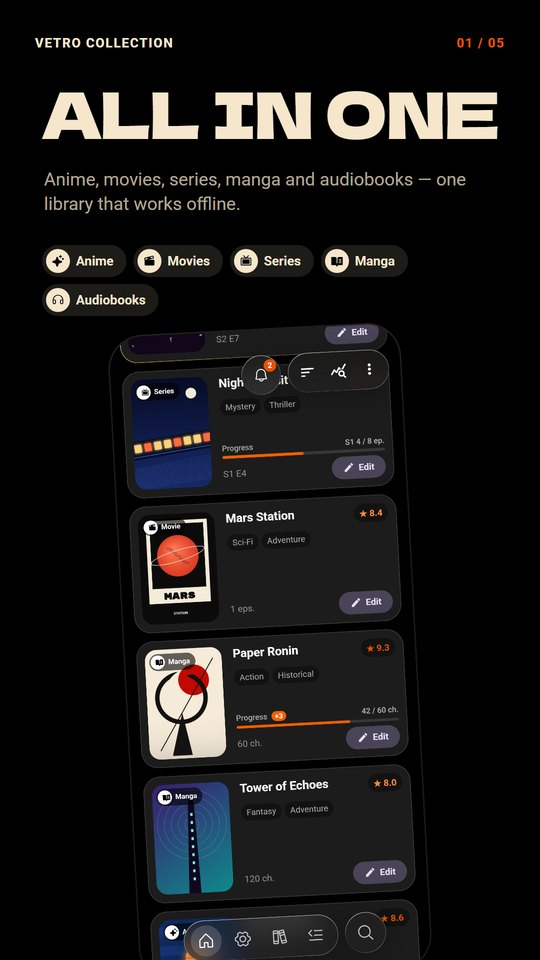
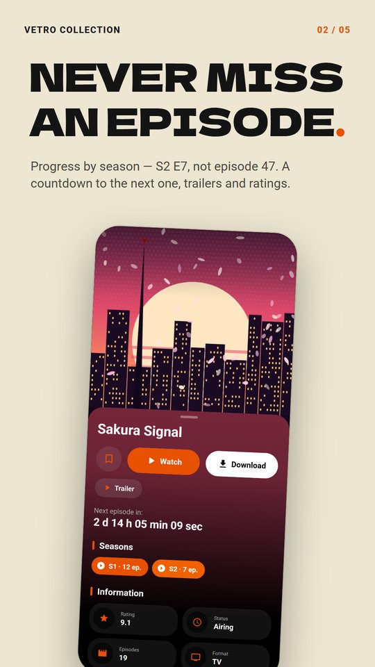
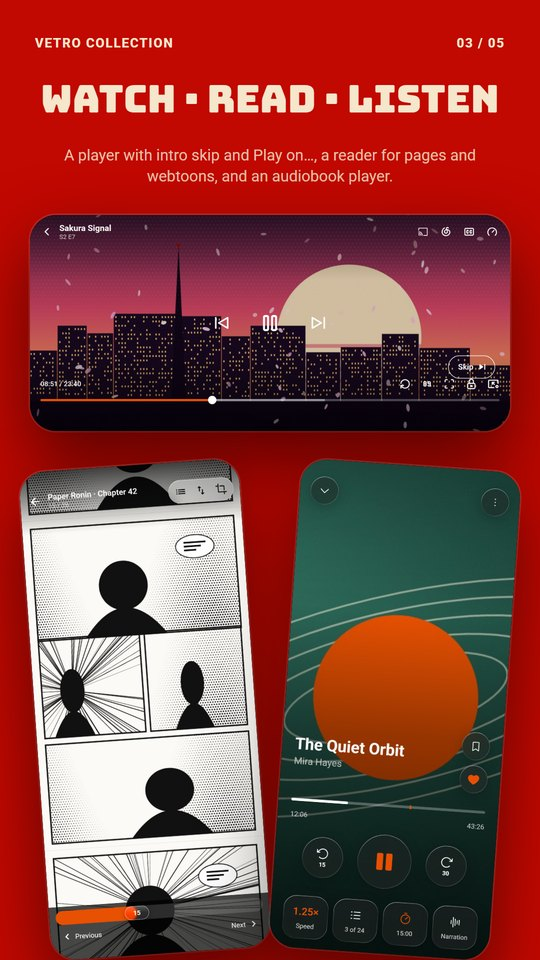
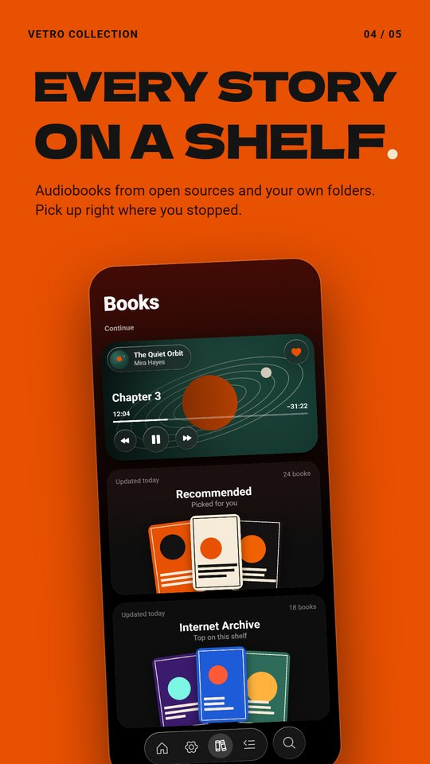
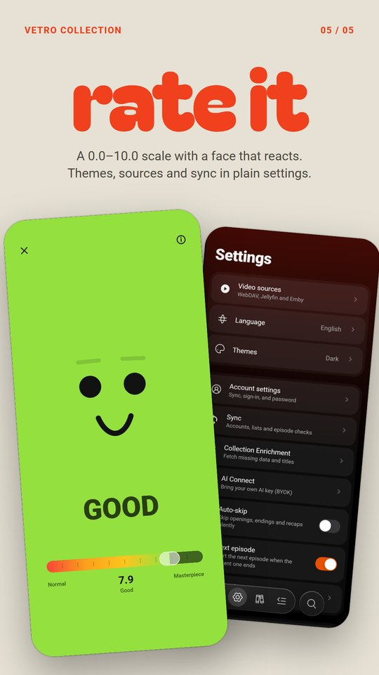

# Vetro

<p align="center">
  
</p>

<p align="center">
  <strong>One place to collect, watch, read, listen to and remember the stories you love.</strong><br />
  Anime · Movies · TV series · Manga · Manhwa · Audiobooks
</p>

<p align="center">
  <a href="https://github.com/Phnem/Vetro/releases/latest"></a>
  <a href="https://github.com/Phnem/Vetro/releases"></a>
  <a href="LICENSE"></a>
  
</p>

<p align="center">
  <a href="https://github.com/Phnem/Vetro/releases">Releases</a> ·
  <a href="#screens">Screens</a> ·
  <a href="#install">Install</a> ·
  <a href="PRIVACY.MD">Privacy</a>
</p>

Vetro is an Android media library with a local-first core. Build a personal collection, follow new episodes as they air, then watch, read or listen without leaving the app. An account and cloud features are optional: the collection works fully offline.

Vetro does not host any media. It connects to catalogues and sources that you choose, including your own servers.

> **Current development build:** `v3.3.5-Beta`. The app is actively evolving; source availability can vary by region.

## Trailer

<p align="center">
  <a href="images/promo/vetro-trailer.mp4">
    
  </a>
  <br />
  <sub>▶ Tap to watch the full trailer — 1080 × 1920, 60 fps, with sound.</sub>
</p>

## What Vetro does

### Your collection

- Anime, films, TV series, manga, manhwa and audiobooks in one library.
- Add titles from search with cover art, genres, descriptions and a 0.0–10.0 score; favourites, notes and watch or reading progress.
- Filter by content type, sort, and search locally or online.
- Statistics with short AI-written explanations (optional), and a recommendations deck you swipe through.
- Background enrichment fills in missing titles, IDs and links, and keeps episode counts current.

### Always know what's new

- Episode checks across AniList, Shikimori and MyAnimeList, plus TMDB for TV series.
- Progress is counted by season: cards show `S3 E12` instead of a franchise-wide total.
- New episodes arrive as a stack of notification cards. They fold into a bell next to the dock and open as a notification centre.
- Titles that are airing or have unread episodes stay at the top of the library, under favourites.
- Details show a countdown to the next episode, a trailer, critic ratings, the title logo, backdrop art and Russian dub studios.

### Watch

- A built-in player with picture-in-picture, episode navigation, auto-next and intro skipping (Anime-Skip, IntroDB and source timings).
- Gestures: double-tap seek that accumulates, hold for 2×, pinch to zoom, brightness and volume on vertical swipes, and undo for an accidental seek.
- If a source fails mid-episode, playback moves to another one and keeps the chosen dub.
- Films and series have their own source cascade, separate for Russian and English.
- Add your own sources: direct links, WebDAV, Jellyfin, Emby, Stremio add-ons and declarative provider packages. Imported packages run sandboxed and are signature-checked.
- **Play on…**: send an episode to a TV over Google Cast or DLNA and control it from Vetro. A secure local proxy handles streams the TV can't open directly.
- A system media card with poster, `S2 E5`, seek and episode buttons.
- Download single episodes or whole seasons for offline playback, with resumable HLS downloads.

### Subtitles

- Search and pick subtitles from OpenSubtitles, including with your own OpenSubtitles account and API key.
- Generate subtitles on the device with Whisper (whisper.cpp). Models are downloaded in the app; recognition runs locally on arm64 phones.

### Listen to audiobooks

- A separate Books section with shelves from Russian and English sources, cross-source search and automatic fallback when a source goes down.
- Some sources stream while the file is still downloading.
- Add your own audiobook folders; the library then groups them into one shelf per author.
- Sleep timer, skip silence (Off / Light / Normal / Aggressive), playback speed, bookmarks, undo seek and a mini player.
- Chapters are recovered for books that ship without them: from CUE sheets, pauses in the audio or speech recognition.
- Subtitles from the book's own text, kept in sync with the narrator.
- A rich system media card: book, author, chapter, cover, speed and favourite buttons.

### Read manga and manhwa

- Chapters from supported sources, offline downloads, and vertical webtoon or paged layouts.
- Page direction, layout and scan-margin cropping are remembered per title; reading progress shows on library cards.

### Make it yours

- Light and dark themes, English and Russian interface.
- iOS-style motion throughout: spring physics, iOS scrolling with rubber-band edges, swipe back from Details, and frosted-glass surfaces.
- Optional cloud account (Supabase) with sync and backup, plus import and export of Shikimori, MyAnimeList and AniList lists.
- Optional Bring Your Own Key (BYOK) AI provider for AI-assisted features.
- A shareable PDF export of the collection, plus database maintenance and diagnostics in Developer Settings.

## Screens

<p align="center">
  <a href="images/preview/01-library.png"></a>
  <a href="images/preview/02-episodes.png"></a>
  <a href="images/preview/03-watch-read-listen.png"></a>
</p>
<p align="center">
  <a href="images/preview/04-books.png"></a>
  <a href="images/preview/05-rate.png"></a>
</p>
<p align="center"><sub>Tap any screen to open it in full resolution.</sub></p>

## Install

Choose the distribution channel you prefer:

<p align="center">
  <a href="https://github-store.org/app?repo=Phnem/Vetro"></a>
  <a href="https://f-droid.org/packages/com.phnem.vetro"></a>
  <a href="obtainium://app/add?url=https://github.com/Phnem/Vetro"></a>
</p>

Vetro runs on Android 8.0 (API 26) and newer. On-device subtitle recognition and torrent-based audiobook sources need a 64-bit ARM (arm64) device.

## Build from source

Requirements:

- Android Studio with JDK 21
- Android SDK 36, plus the NDK and CMake 3.22.1 (SDK Manager → SDK Tools)
- An Android device or emulator running Android 8.0 (API 26) or newer

whisper.cpp is a git submodule, so clone with submodules:

```bash
git clone --recurse-submodules https://github.com/Phnem/Vetro.git
cd Vetro
./gradlew assembleDebug
```

On an existing checkout, run `git submodule update --init` first. On Windows, use `gradlew.bat assembleDebug`. The debug APK is written to `app/build/outputs/apk/debug/`.

### Optional service configuration

Copy `local.properties.example` to `local.properties` and fill in only the integrations you plan to use. OAuth and Supabase values are read from environment variables first, then from `local.properties`. Catalogue and enrichment keys (TMDB, Kinopoisk, OpenSubtitles, OMDb, YouTube, Fanart.tv, Google Books and others) are read from `local.properties`. An empty value switches the related feature off. Never commit this file, API keys or signing keys.

## Architecture

Vetro is a Kotlin and Jetpack Compose Android application with unidirectional state flow and separate data, domain and UI layers.

- **Modules:** `:app`, `:core:network` (catalogue, source and enrichment clients), `:baselineprofile`, and `build-logic` for convention plugins.
- **UI:** Jetpack Compose, Navigation Compose, a custom iOS-style design system (spring motion tokens, frosted glass), Material 3 where it fits.
- **State and DI:** immutable UI state, Kotlin Flow, ViewModels and Koin.
- **Data:** SQLDelight, DataStore, small JSON file caches, and WorkManager for downloads, sync and background checks.
- **Network:** Ktor on a single shared OkHttp client, Apollo GraphQL for AniList, per-host rate limiting and circuit breakers.
- **Playback:** AndroidX Media3 / ExoPlayer; Google Cast and DLNA for remote playback; libtorrent4j for streaming torrent sources.
- **Native:** whisper.cpp built with the NDK for on-device speech recognition.
- **Performance:** a shipped baseline profile, narrow R8 rules and ast-grep UI guardrails (`scripts/lint-ui.sh`).

## Privacy

Vetro is local-first and does not require an account to manage a collection. Network requests happen when you use online search, episode checks, media sources, enrichment, sync or backup, update checks, or an optional AI provider. Credentials for your own servers and accounts are stored encrypted on the device. See [PRIVACY.MD](PRIVACY.MD) for the full policy.

## Contributing

Issues and pull requests are welcome. Before proposing a change, please read the existing architecture, and keep secrets, signing keys, build output and personal `local.properties` files out of commits.

## License

Vetro is released under the [MIT License](LICENSE).
